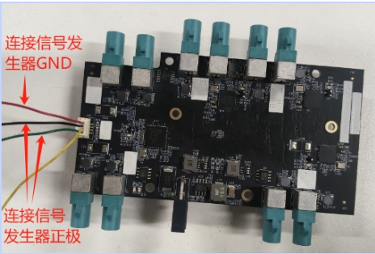

#### Jetpack version

* Jetpack 6.2

#### Supported Camera

```
Camera Model        Sensor      Resolution        Output      Interface  frame_rate
SHW5G             ST VB1940     2560*1984         RAW10         GMSL2        60
```
Camera Capacity: Supports up to 8 cameras lighting up and streaming at the same time.

MAX96712 Constraints: Each MAX96712 chip is limited to 2 simultaneous camera streams. Thus, out of the four available ports (J27-J30), only two cameras can be connected and operated at once.
#### Quick Bring Up

1. Connect the Camera to the ports on the adapter board.

   1.1 Connect the Camera to the ports on the adapter board.

   The correspondence between CAM ports and device nodes is as follows:
     

    ```
    PORT                    DEV NODE                    
    J25                     /dev/video0                 
    J26                     /dev/video1                 
    J23                     /dev/video2                 
    J24                     /dev/video3                 
    J21                     /dev/video4                 
    J22                     /dev/video5                 
    J27                     /dev/video6                 
    J28                     /dev/video7                 
    J29                     /dev/video8                 
    J30                     /dev/video9                 
    ```

   1.2 Power Supply
   SG10A_AGON_G2M_A1 adapt board need to be powered by 12V.
 

2. Copy the driver package to the working directory of the Jetson device, such as “/home/nvidia”

   ```
   /home/nvidia/SG10A_AGON_G2M_A1_AGX_ORIN_SHW5G_60fps_JP6.2_L4TR36.4.3
   ```
3. Enter the driver directory, run the script "install.sh"

   ```
   cd SG10A_AGON_G2M_A1_AGX_ORIN_SHW5G_60fps_JP6.2_L4TR36.4.3
   chmod a+x ./install.sh
   ./install.sh
   ```
4. update the ISP settings for SHW5G

   ```
   sudo cp ISP_File/camera_overrides.isp /var/nvidia/nvcam/settings/
   ```

5. Use the "sudo /opt/nvidia/jetson-io/jetson-io.py" command to select the corresponding device

   ```
   sudo /opt/nvidia/jetson-io/jetson-io.py

   1.select "Configure Jetson AGX CSI Connector"
   2.select "Configure for compatible hardware"
   3.select "Jetson Sensing SG10A_AGON_G2M_A1 SHW5G GMSL2x10"
   4.select "Save pin changes"
   5.select "Save and reboot to reconfigure pins"
   ```

6. Bring up the camera

   6.1 After reboot,enter the driver directory,run the script "load_module.sh".
   ```
   sudo ./load_modules.sh
   ```
   After the module is loaded, the device nodes /dev/video0~video9 will be generated.

   6.2 Install argus_camera
   ```
   sudo apt-get install nvidia-l4t-jetson-multimedia-api
   ```
   After installation, the jetson_multimedia_api folder can be found in the /usr/src directory. Then refer to the documentation /usr/src/jetson_multimedia_api/argus/README.TXT to install argus_camera.

   6.3 Bring up the RAW camera

   ```
   ## Video0
   argus_camera -d 0

   ## Video1
   argus_camera -d 1

   ## Video2
   argus_camera -d 2

   ## Video3
   argus_camera -d 3

   ## Video4
   argus_camera -d 4

   ## Video5
   argus_camera -d 5

   ## Video6
   argus_camera -d 6

   ## Video7
   argus_camera -d 7

   ## Video8
   argus_camera -d 8

   ## Video9
   argus_camera -d 9
   ```
   If you experience a blurry image, try replacing the ISP processing library by executing the following command. It is recommended to back up the original library file first. Please reboot the system after replacement for the changes to take effect.
   ```
   sudo cp ISP_File/libnvisppg.so  /usr/lib/aarch64-linux-gnu/nvidia/
   ```
7. Camera Trigger Sync 

   7.1 Modify load_modules.sh script and re-run it.
   ```
    v4l2-ctl -d /dev/video0 -c sensor_mode=0,trig_mode=1
    v4l2-ctl -d /dev/video1 -c sensor_mode=0,trig_mode=1
    v4l2-ctl -d /dev/video2 -c sensor_mode=0,trig_mode=1
    v4l2-ctl -d /dev/video3 -c sensor_mode=0,trig_mode=1
    v4l2-ctl -d /dev/video4 -c sensor_mode=0,trig_mode=1
    v4l2-ctl -d /dev/video5 -c sensor_mode=0,trig_mode=1
    v4l2-ctl -d /dev/video6 -c sensor_mode=0,trig_mode=1
    v4l2-ctl -d /dev/video7 -c sensor_mode=0,trig_mode=1
    v4l2-ctl -d /dev/video8 -c sensor_mode=0,trig_mode=1
    v4l2-ctl -d /dev/video9 -c sensor_mode=0,trig_mode=1
   ```
   echo 0 > /sys/class/pwm/pwmchip4/export
   echo 40000000 > /sys/class/pwm/pwmchip4/pwm0/period 
   echo 10000000 > /sys/class/pwm/pwmchip4/pwm0/duty_cycle 
   echo 1 /sys/class/pwm/pwmchip4/pwm0/enable 
   ```
   For Auto-trigger Mode (The cameras are triggered automatically upon camera activation. However, the cameras are not synchronized):trig_mode=0

   For External Trigger Mode (Camera triggering and synchronization are achieved via signals from an external signal generator):trig_mode=1
   ```
   7.2 External Trigger Mode
  
   When using an external trigger signal generator, please make connections as shown in the diagram below: connect the black and green wires to the positive pole of the signal generator, and the red wire to the GND of the signal generator.
  
   


#### Integration with SENSING Driver Source Code

1. Compile Image & dtb
   Refer to the following command to integrate Dtb and Kernel source code to your kernel

   ```
   cp camera-driver-package/source/hardware Linux_for_Tegra/source/hardware -r
   cp camera-driver-package/source/kernel Linux_for_Tegra/source/kernel -r
   cp camera-driver-package/source/nvidia-oot Linux_for_Tegra/source/nvidia-oot -r
   ```
2. Go to the root directory of your source code and recompile

   ```
   cd <install-path>/Linux_for_Tegra/source
   export CROSS_COMPILE_AARCH64=toolchain-path/bin/aarch64-buildroot-linux-gnu-
   export KERNEL_HEADERS=$PWD/kernel/kernel-jammy-src
   export INSTALL_MOD_PATH=<install-path>/Linux_for_Tegra/rootfs/
   make -C kernel
   make modules
   make dtbs
   sudo -E make install -C kernel

   cp kernel/kernel-jammy-src/arch/arm64/boot/Image <install-path>/Linux_for_Tegra/kernel/Image
   cp nvidia-oot/device-tree/platform/generic-dts/dtbs/* <install-path>/Linux_for_Tegra/kernel/dtb/
   ```
3. Install the newly generated Image and dtb to your nvidia device and reboot to let them take effect

   ```
   dtb:nvidia-oot/device-tree/platform/generic-dts/dtbs/
   Image: kernel/kernel-jammy-src/arch/arm64/boot/

   tegra-camera.ko:nvidia-oot/drivers/media/platform/tegra/camera/
   nvhost-nvcsi-t194.ko:nvidia-oot/drivers/video/tegra/host/nvcsi/
   ```
4. Copy the image,dtb,ko generated by the above compilation to the corresponding location of jetson

   ```
   sudo cp *.dtbo /boot/
   sudo cp Image /boot/Image
   sudo cp tegra-camera.ko /lib/modules/5.15.148-tegra/updates/drivers/media/platform/tegra/camera/
   sudo cp nvhost-nvcsi-t194.ko /lib/modules/5.15.148-tegra/updates/drivers/video/tegra/host/nvcsi/
   ```
5. Select the device tree you installed

   ```
   sudo /opt/nvidia/jetson-io/jetson-io.py

   1.select "Configure Jetson AGX CSI Connector"
   2.select "Configure for compatible hardware"
   3.select "Jetson Sensing SG10A_AGON_G2M_A1 SHW5G GMSL2x10"
   4.select "Save pin changes"
   5.select "Save and reboot to reconfigure pins"
   ```
6. Install camera driver

   ```
   sudo insmod ko/shw5g.ko
   ```
7. Bring up the camera

   ```
   ## Video0
   v4l2-ctl -d /dev/video0 -c sensor_mode=0,trig_mode=?
   argus_camera -d 0

   ## Video1
   v4l2-ctl -d /dev/video1 -c sensor_mode=0,trig_mode=?
   argus_camera -d 1
    ...
   ```
