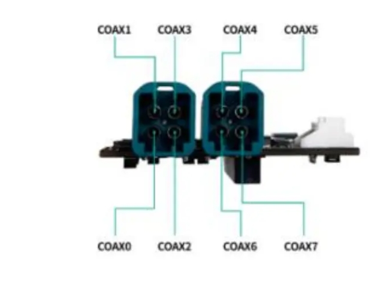

#### Jetpack version

* Jetpack 6.2

#### Supported Camera

```
Camera Model                         Sensor      Resolution        Output      Interface      frame_rate
SI20-AR2020M-G2G-HxxM           ONSEMI AR2020     5120*3840         RAW10       GMSL2-6G         15
SG5-VB1940-G2G-HxxM               ST VB1940       2560*1984         RAW10       GMSL2-6G         30
```
 Note:The SI20-AR2020M-G2G-HxxM camera can only stably reach a maximum trigger rate of 14 fps in Orin Trigger Mode / External Trigger Mode.
#### Quick Bring Up

1. Connect the Camera to the ports on the adapter board.

   1.1 Mapping of hardware ports to /dev/video nodes

    The mapping between physical COAX ports and their corresponding /dev/video device nodes is illustrated below:
     
    
    ```
    PORT                       DEV NODE                    
    COAX0                     /dev/video0                 
    COAX1                     /dev/video1                 
    COAX2                     /dev/video2                 
    COAX3                     /dev/video3                 
    COAX4                     /dev/video4                 
    COAX5                     /dev/video5                 
    COAX6                     /dev/video6                 
    COAX7                     /dev/video7                                              
    ```
    1.2 Connect the Camera to the ports on the adapter board.

   SI20-AR2020M-G2G-HxxM: COAX0/COAX1/COAX2/COAX3

   SG5-VB1940-G2G-HxxM : COAX6

   1.3 Power Supply
   SG8A_AGON_G2Y_A1 adapt board need to be powered by 12V.
 

2. Copy the driver package to the working directory of the Jetson device, such as “/home/nvidia”

   ```
   /home/nvidia/SG8A_AGON_G2Y_A1_AGX_ORIN_AR2020MX4_VB1940X1_JP6.2_L4TR36.4.3
   ```
3. Enter the driver directory, run the script "install.sh"

   ```
   cd SG8A_AGON_G2Y_A1_AGX_ORIN_AR2020MX4_VB1940X1_JP6.2_L4TR36.4.3
   chmod a+x ./install.sh
   ./install.sh
   ```

   
4. Use the "sudo /opt/nvidia/jetson-io/jetson-io.py" command to select the corresponding device

   ```
   sudo /opt/nvidia/jetson-io/jetson-io.py

   1.select "Configure Jetson AGX CSI Connector"
   2.select "Configure for compatible hardware"
   3.select "Jetson Sensing SG8A-AGON-G2Y-A1 AR2020Mx4 AND SHW3Gx1"
   4.select "Save pin changes"
   5.select "Save and reboot to reconfigure pins"
   ```

5. Bring up the camera

   5.1 After reboot,enter the driver directory,run the script "load_module.sh".
   ```
   sudo ./load_modules.sh
   ```
   After the module is loaded, the device nodes /dev/video0~video7 will be generated.

   5.2 Install argus_camera
   ```
   sudo apt-get install nvidia-l4t-jetson-multimedia-api
   ```
   After installation, the jetson_multimedia_api folder can be found in the /usr/src directory. Then refer to the documentation /usr/src/jetson_multimedia_api/argus/README.TXT to install argus_camera.

   5.3 Bring up the RAW camera

   ```
   ## Video0
   argus_camera -d 0

   ## Video1
   argus_camera -d 1

   ## Video2
   argus_camera -d 2

   ## Video3
   argus_camera -d 3

   ## Video6
   argus_camera -d 6
   ```
 
6. Camera Trigger Sync 

   6.1 Modify load_modules.sh script and re-run it.
   ```
    v4l2-ctl -d /dev/video0 -c sensor_mode=0,trig_mode=1
    v4l2-ctl -d /dev/video1 -c sensor_mode=0,trig_mode=1
    v4l2-ctl -d /dev/video2 -c sensor_mode=0,trig_mode=1
    v4l2-ctl -d /dev/video3 -c sensor_mode=0,trig_mode=1
    v4l2-ctl -d /dev/video4 -c sensor_mode=0,trig_mode=1
    v4l2-ctl -d /dev/video5 -c sensor_mode=0,trig_mode=1
    v4l2-ctl -d /dev/video6 -c sensor_mode=0,trig_mode=1
    v4l2-ctl -d /dev/video7 -c sensor_mode=0,trig_mode=1
   ```
   
   ```
   For Auto-trigger Mode (The cameras are triggered automatically upon camera activation. However, the cameras are not synchronized):trig_mode=0

    For External Trigger Mode (Camera triggering and synchronization are achieved via signals from an external signal generator):trig_mode=1

   For Jetson Orin Trigger Mode (The cameras are triggered and synchronized through the trigger signal generated from the Jetson Orin):trig_mode=1
   ```
   Note:The SI20-AR2020M-G2G-HxxM camera can only stably reach a maximum trigger rate of 14 fps in Orin Trigger Mode / External Trigger Mode.

   6.2 External Trigger Mode

   External Trigger Port: CN4

   The PIN1(CAM-FSYNC1) and PIN6 correspond to the external trigger signal pin and ground pin respectively. 
   Connect the corresponding pins of the signal generator to these pins.

   ```
   CAM-FSYNC1 Pin Trigger Signal Parameters:
   Frequency: 14 Hz
   Amplitude: 3.3V
   Bias: 1.6V
   Duty Cycle: 10%

   PIN 6: GND
   ```

   6.3 Internal Trigger Mode

   ```
   # Export PWM channel 0
   echo 0 > /sys/class/pwm/pwmchip5/export

   # Set the period to 71428571 (corresponding to 14 Hz)
   echo 71428571 > /sys/class/pwm/pwmchip5/pwm0/period

   # Set the duty cycle
   echo 64285714 > /sys/class/pwm/pwmchip5/pwm0/duty_cycle

   # Enable PWM output
   echo 1 > /sys/class/pwm/pwmchip5/pwm0/enable
   ```


#### Integration with SENSING Driver Source Code

1. Compile Image & dtb
   Refer to the following command to integrate Dtb and Kernel source code to your kernel

   ```
   cp camera-driver-package/source/hardware Linux_for_Tegra/source/$YourDir/hardware -r
   cp camera-driver-package/source/kernel Linux_for_Tegra/source/$YourDir/kernel -r
   cp camera-driver-package/source/nvidia-oot Linux_for_Tegra/source/$YourDir/nvidia-oot -r
   ```
2. Go to the root directory of your source code and recompile

   ```
   cd <install-path>/Linux_for_Tegra/source/$YourDir/
   export CROSS_COMPILE=<toolchain-path>/aarch64-none-linux-gnu/bin/aarch64-none-linux-gnu-
   export KERNEL_HEADERS=$PWD/kernel/kernel-noble
   export kernel_name=noble
   export INSTALL_MOD_PATH=<install-path>/Linux_for_Tegra/rootfs/
   make -C kernel
   make modules
   make dtbs
   sudo -E make install -C kernel
   sudo -E make modules_install

   cp kernel/kernel-noble/arch/arm64/boot/Image <install-path>/Linux_for_Tegra/kernel/Image
   cp kernel-devicetree/generic-dts/dtbs/* <install-path>/Linux_for_Tegra/kernel/dtb/
   ```
3. Install the newly generated Image and dtb to your nvidia device and reboot to let them take effect

   ```
   dtbo: kernel-devicetree/generic-dts/dtbs/
   Image: kernel/kernel-noble/arch/arm64/boot/

   tegra-camera.ko: nvidia-oot/drivers/media/platform/tegra/camera/
   nvhost-nvcsi.ko: nvidia-oot/drivers/video/tegra/host/nvcsi/nvhost-nvcsi.ko
   ```
4. Copy the image,dtb,ko generated by the above compilation to the corresponding location of jetson

   ```
   sudo cp *.dtbo /boot/
   sudo cp Image /boot/Image
   sudo cp ko/tegra-camera.ko /lib/modules/5.15.148-tegra/updates/drivers/media/platform/tegra/camera/
   sudo cp ko/nvhost-nvcsi.ko /lib/modules/5.15.148-tegra/updates/drivers/video/tegra/host/nvcsi/
   ```
5. Select the device tree you installed

   ```
   sudo /opt/nvidia/jetson-io/jetson-io.py

   1.select "Configure Jetson AGX CSI Connector"
   2.select "Configure for compatible hardware"
   3.select "Jetson Sensing SG8A-AGON-G2Y-A1 AR2020Mx4 AND SHW3Gx1"
   4.select "Save pin changes"
   5.select "Save and reboot to reconfigure pins"
   ```
6. Install camera driver

   ```
   sudo insmod ko/max96712.ko
   sudo insmod ko/ar2020m.ko
   sudo insmod ko/shw5g.ko
   ```
7. Bring up the camera

   ```
   ## Video0
   v4l2-ctl -d /dev/video0 -c sensor_mode=0,trig_mode=?
   argus_camera -d 0

   ## Video1
   v4l2-ctl -d /dev/video1 -c sensor_mode=0,trig_mode=?
   argus_camera -d 1
    ...
   ```
