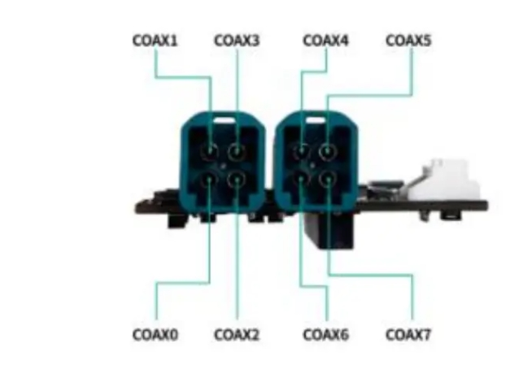

#### Jetpack version

* Jetpack 7.2.1

#### Supported Camera Modules
* S56C

* SHF3L

* SHW5G

#### Quick Bring Up

1. Connect the Camera to the ports on the adapter board.

   

   CN1 (CAM0/CAM1/CAM2/CAM3)

   CN2 (CAM4/CAM5/CAM6/CAM7)

2. Copy the driver package to the working directory of the Jetson device, such as “/home/nvidia”

   ```
   /home/nvidia/SG8A_AGON_G2Y_A1_AGX_ORIN_S56C_SHW5G_SHF3L_SIPL_JP7.2.1_L4TR39.2.1
   ```
3. Enter the driver directory, run the script "install.sh"

   ```
   cd SG8A_AGON_G2Y_A1_AGX_ORIN_S56C_SHW5G_SHF3L_SIPL_JP7.2.1_L4TR39.2.1
   chmod a+x ./install.sh
   ./install.sh
   ```
4. Use the "sudo /opt/nvidia/jetson-io/jetson-io.py" command to select camera overly file

   ```
   sudo /opt/nvidia/jetson-io/jetson-io.py

   1.select "Configure Jetson AGX CSI Connector"
   2.select "Configure for compatible hardware"
   3.select "Jetson Sensing SG8A-AGON-G2Y-A1 SIPL GMSL2x8"
   4.select "Save pin changes"
   5.select "Save and reboot to reconfigure pins"
   ```
5. Bring up the camera

   After the device reboots, switch the Jetson device to maximum performance mode
   ```
   sudo nvpmodel -m 0
   sudo jetson_clocks
   ```

   5.1 For Astra S56Cx1+SHF3Lx2 Camera Module

   [How to bring up Astra S56Cx1+SHW5Gx2 Camera Module](docs/s56c_shf3l_mixed.md)


   5.2 For Astra SHW5Gx2+SHF3Lx2 Camera Module

   [How to bring up Astra SHW5Gx2+SHF3Lx2 Camera Module](docs/shw5g_shf3l_mixed.md)

6. Camera Trigger Sync

   
   fsyncMode field description:
   ```
   osc_manual: The deserializer generates the synchronization trigger for all cameras connected to the same deserializer. An external trigger signal is not required.In this version, the 1st deserializer (CAM0-CAM3) outputs a 60Hz synchronization signal, and the 2nd deserializer (CAM4-CAM7) outputs a 30Hz synchronization signal.
  
   ```

   


