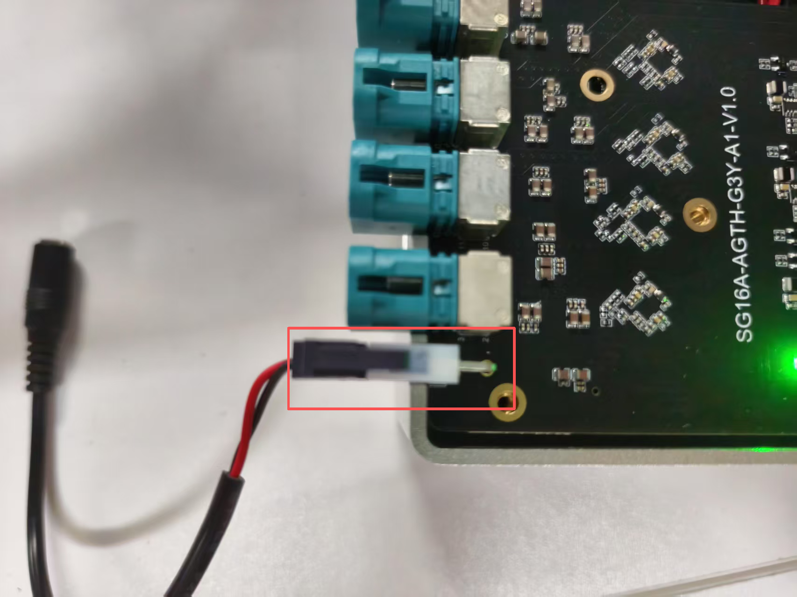

#### Jetpack version

- Jetpack 7.0 L4TR38.2.1

#### Supported Camera

```
Camera Model                  Sensor         Resolution        Output      Interface  frame_rate
SG2-AR0234C-G2G-HXXX       ONsemi AR0234     1920*1080         RAW10         GMSL2      60/120
```

#### Quick Bring Up

1. Hardware Connect

   1.1 Connect the Camera to the ports on the adapter board.
   The correspondence between CAM ports and device nodes is as follows:
   ```
   PORT                    DeviceTree Node           DEV NODE                    
   CAM0                        cam_0                /dev/video0                 
   CAM1                        cam_1                /dev/video1                 
   CAM2                        cam_2                /dev/video2                 
   CAM3                        cam_3                /dev/video3                 
   CAM4                        cam_4                /dev/video4                 
   CAM5                        cam_5                /dev/video5                 
   CAM6                        cam_6                /dev/video6 
   CAM7                        cam_7                /dev/video7           
   CAM8                        cam_8                /dev/video8                 
   CAM9                        cam_9                /dev/video9                 
   CAM10                       cam_10               /dev/video10                 
   CAM11                       cam_11               /dev/video11                 
   CAM12                       cam_12               /dev/video12                 
   CAM13                       cam_13               /dev/video13                 
   CAM14                       cam_14               /dev/video14 
   CAM15                       cam_15               /dev/video15         
   ```
   1.2 Power Supply
   SG16A_AGTH_G3Y_A1 adapt board need to be powered by 12V.
   

2. Copy the driver package to the working directory of the Jetson device, such as “/home/nvidia”
   ```
   /home/nvidia/TRD3_G3A_AR0234C-G2G_JP7.0_L4TR38.2.1
   ```
   
3. Enter the driver directory, run the script "install.sh""
   ```
   cd TRD3_G3A_AR0234C-G2G_JP7.0_L4TR38.2.1
   chmod a+x ./install.sh
   ./install.sh
   ```

4. Use the "sudo /opt/nvidia/jetson-io/jetson-io.py" command to select the corresponding device.

   ```
   sudo /opt/nvidia/jetson-io/jetson-io.py

   1.select "Configure Jetson AGX CSI Connector"
   2.select "Configure for compatible hardware"
   3.select "Jetson Sensing SG16A_AGTH_G3Y_A1 AR0234Cx16"
   4.select "Save pin changes"
   5.select "Save and reboot to reconfigure pins"
   ```

5. Bring up the camera

   5.1 Modify the sensor_mode parameter in load_module.sh, and then run the script.

   To output 60FPS, set the sensor_mode to 0 for the corresponding video node in load_module.sh. For 120FPS, change it to 1
   ```
   # for 60fps
   v4l2-ctl -d /dev/video1 -c sensor_mode=0,trig_pin=0x00020007,trig_mode=0

   #for 120fps
   v4l2-ctl -d /dev/video1 -c sensor_mode=1,trig_pin=0x00020007,trig_mode=0
   ```
   Then,run the script.
   ```
   sudo ./load_modules.sh
   ```
   After the module is loaded, the device nodes /dev/video0~video15 will be generated.

   5.2 Install argus_camera
   ```
   sudo apt-get install nvidia-l4t-jetson-multimedia-api
   ```
   After installation, the jetson_multimedia_api folder can be found in the /usr/src directory. Then refer to the documentation /usr/src/jetson_multimedia_api/argus/README.TXT to install argus_camera.

   5.3 Bring up the RAW camera

   Start nvargus-daemon in a terminal
   ```
   sudo service nvargus-daemon stop
   export NVCAMERA_NITO_PATH=CONFIG
   sudo -E enableCamInfiniteTimeout=1 nvargus-daemon
   ```
   Start argus_camera in another terminal
   ```
   ## Video0
   argus_camera -d 0 

   ## Video1
   argus_camera -d 1

   ## Video2
   argus_camera -d 2

   ## Video3
   argus_camera -d 3

   ## Video4
   argus_camera -d 4

   ## Video5
   argus_camera -d 5

   ## Video6
   argus_camera -d 6

   ## Video7
   argus_camera -d 7

   ## Video8
   argus_camera -d 8

   ## Video9
   argus_camera -d 9

   ## Video10
   argus_camera -d 10

   ## Video11
   argus_camera -d 11

   ## Video12
   argus_camera -d 12

   ## Video13
   argus_camera -d 13

   ## Video14
   argus_camera -d 14

   ## Video15
   argus_camera -d 15

   ```
   Note:Argus uses sensor_mode=0 by default on startup. You can specify a different mode using the "--sensormode=*" parameter.
   
   ```
   argus_camera -d 0 --sensormode=1
   ```
6. Camera Trigger Sync 

   6.1 Modify load_modules.sh script and re-run it.
   ```
   v4l2-ctl -d /dev/video0 -c sensor_mode=0,trig_pin=0x00020007,trig_mode=1
   v4l2-ctl -d /dev/video1 -c sensor_mode=0,trig_pin=0x00020007,trig_mode=1
   v4l2-ctl -d /dev/video2 -c sensor_mode=0,trig_pin=0x00020007,trig_mode=1
   v4l2-ctl -d /dev/video3 -c sensor_mode=0,trig_pin=0x00020007,trig_mode=1
   v4l2-ctl -d /dev/video4 -c sensor_mode=0,trig_pin=0x00020007,trig_mode=1
   v4l2-ctl -d /dev/video5 -c sensor_mode=0,trig_pin=0x00020007,trig_mode=1
   v4l2-ctl -d /dev/video6 -c sensor_mode=0,trig_pin=0x00020007,trig_mode=1
   v4l2-ctl -d /dev/video7 -c sensor_mode=0,trig_pin=0x00020007,trig_mode=1
   v4l2-ctl -d /dev/video8 -c sensor_mode=0,trig_pin=0x00020007,trig_mode=1
   v4l2-ctl -d /dev/video9 -c sensor_mode=0,trig_pin=0x00020007,trig_mode=1
   v4l2-ctl -d /dev/video10 -c sensor_mode=0,trig_pin=0x00020007,trig_mode=1
   v4l2-ctl -d /dev/video11 -c sensor_mode=0,trig_pin=0x00020007,trig_mode=1
   v4l2-ctl -d /dev/video12 -c sensor_mode=0,trig_pin=0x00020007,trig_mode=1
   v4l2-ctl -d /dev/video13 -c sensor_mode=0,trig_pin=0x00020007,trig_mode=1
   v4l2-ctl -d /dev/video14 -c sensor_mode=0,trig_pin=0x00020007,trig_mode=1
   v4l2-ctl -d /dev/video15 -c sensor_mode=0,trig_pin=0x00020007,trig_mode=1
   ```
   The "trig_mode" and "trig_pin" parameters denote the trigger mode and the corresponding trigger pin to be utilized.
   ```
   For Auto-trigger Mode (The cameras are triggered automatically upon camera activation. However, the cameras are not synchronized):trig_mode=0;trig_pin=0x00020007

   For Jetson Orin Trigger Mode (The cameras are triggered and synchronized through the trigger signal generated from the Jetson Orin):trig_mode=1;trig_pin=0x00020007
   ```
   6.2 Jetson Orin Trigger Mode

   ```
   a.load the driver
   sudo insmod ko/pwm-gpio.ko
   
   b.Export PWM channel 0 (pwmchip6 is a newly generated node after loading the driver)
   echo 0 > /sys/class/pwm/pwmchip6/export
   
   c.Set the period to 16666666 (corresponding to 60 Hz)
   echo 16666666 > /sys/class/pwm/pwmchip6/pwm0/period
   
   d.Set the duty cycle
   echo 15000000 > /sys/class/pwm/pwmchip6/pwm0/duty_cycle
   
   e.Enable PWM output
   echo 1 > /sys/class/pwm/pwmchip6/pwm0/enable
   ```
   

#### Integration with SENSING Driver Source Code

1. Compile Image & dtb
   Refer to the following command to integrate Dtb and Kernel source code to your kernel
   ```
   cp camera-driver-package/source/hardware Linux_for_Tegra/source/hardware -r
   cp camera-driver-package/source/kernel Linux_for_Tegra/source/kernel -r
   cp camera-driver-package/source/nvidia-oot Linux_for_Tegra/source/nvidia-oot -r
   ```
2. Go to the root directory of your source code and recompile
   ```
   cd <install-path>/Linux_for_Tegra/source
   export CROSS_COMPILE=<toolchain-path>/aarch64-none-linux-gnu/bin/aarch64-none-linux-gnu-
   export KERNEL_HEADERS=$PWD/kernel/kernel-noble
   export kernel_name=noble
   export INSTALL_MOD_PATH=<install-path>/Linux_for_Tegra/rootfs/
   make -C kernel
   make modules
   make dtbs
   sudo -E make install -C kernel
   sudo -E make modules_install

   cp kernel/kernel-noble/arch/arm64/boot/Image <install-path>/Linux_for_Tegra/kernel/Image
   cp kernel-devicetree/generic-dts/dtbs/* <install-path>/Linux_for_Tegra/kernel/dtb/
   ```
3. Install the newly generated Image and dtb to your nvidia device and reboot to let them take effect
   ```
   dtbo: kernel-devicetree/generic-dts/dtbs/
   Image: kernel/kernel-noble/arch/arm64/boot/

   tegra-camera.ko: nvidia-oot/drivers/media/platform/tegra/camera/
   nvhost-nvcsi.ko: nvidia-oot/drivers/video/tegra/host/nvcsi/nvhost-nvcsi.ko
   ```
4. Copy the image,dtb,ko generated by the above compilation to the corresponding location of jetson
   ```
   sudo cp *.dtbo /boot/
   sudo cp Image /boot/Image
   sudo cp ko/tegra-camera.ko /lib/modules/6.8.12-tegra/updates/drivers/media/platform/tegra/camera/
   sudo cp ko/nvhost-nvcsi.ko /lib/modules/6.8.12-tegra/updates/drivers/video/tegra/host/nvcsi/
   ```
5. Select the device tree you installed
   ```
   sudo /opt/nvidia/jetson-io/jetson-io.py

   1.select "Configure Jetson AGX CSI Connector"
   2.select "Configure for compatible hardware"
   3.select "Jetson Sensing SG16A_AGTH_G3Y_A1 AR0234Cx16"
   4.select "Save pin changes"
   5.select "Save and reboot to reconfigure pins"
   ```
6. Install camera driver
   ```
   sudo insmod ko/max96726.ko
   sudo insmod ko/sg2-ar0234c-g2g.ko 
   ```
7. Bring up the camera
   ```
    ## Video0
    argus_camera -d 0

    ## Video1
    argus_camera -d 1
    ......
   ```

