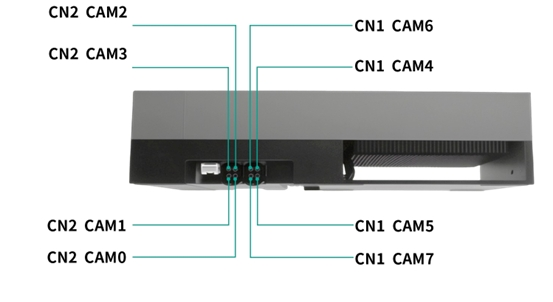

#### Jetpack version

* Jetpack 7.2

#### Supported Camera Modules

* SG8-OX08DC-G2G-Hxxx (Monocular, RAW)
  * support max 4 cameras to bring up at the same time

* SG3-OX03H10C-G2F-Hxxx (Monocular, RAW)
  * support max 8 cameras to bring up at the same time

* SHW5G (Monocular, RAW)
  * support max 8 cameras to bring up at the same time

* Astra S56C (Stereo, RAW)
  * support max 4 cameras to bring up at the same time

* SGX-YUV-GMSL2 (Monocular, YUV)

   * SG2-IMX390C-5200-G2A-Hxxx
      * support max 8 cameras to bring up at the same time

   * SG2-AR0233-5200-G2A-Hxxx
      * support max 8 cameras to bring up at the same time

   * SG3-ISX031C-GMSL2-Hxxx
      * support max 8 cameras to bring up at the same time

   * SG3-ISX031C-GMSL2F-Hxxx
      * support max 8 cameras to bring up at the same time

   * SG5-IMX490C-5300-GMSL2-Hxxx
      * support max 6 cameras to bring up at the same time

   * SG8S-AR0820C-5300-G2A-Hxxx
      * support max 4 cameras to bring up at the same time

   * SG8-OX08DC-5300-G2G-Hxxx
      * support max 4 cameras to bring up at the same time   

   * SHF3L
      * support max 8 cameras to bring up at the same time

   * SHF3H
      * support max 8 cameras to bring up at the same time


#### Quick Bring Up

1. Flashing

    Since NVIDIA's official pinmux definitions do not enable the I2C functionality for I2C9, nor do they enable GPIO functionality for CAM0_PWDN and CAM1_PWDN, it is necessary to modify the pinmux definitions and re-flash the device.

    Copy and replace the files in source/Linux_for_Tegra/bootloader/ from the driver package to $work_path/Linux_for_Tegra/bootloader/


2. Connect the Camera to the ports on the adapter board.

   

   CN2 (CAM0/CAM1/CAM2/CAM3)

   CN1 (CAM4/CAM5/CAM6/CAM7)

   Note: Stereo camera needs an even port (CAM0/2/4/6) and the next port must be free.


3. Copy the driver package to the working directory of the Jetson device, such as “/home/nvidia”

   ```
   /home/nvidia/TRD1_G2A_AGX_THOR_SIPL_JP7.2_L4TR39.2
   ```
4. Enter the driver directory, run the script "install.sh""

   ```
   cd TRD1_G2A_AGX_THOR_SIPL_JP7.2_L4TR39.2
   chmod a+x ./install.sh
   ./install.sh
   ```

5. Bring up the camera

   After the device reboots, switch the Jetson device to maximum performance mode
   ```
   sudo nvpmodel -m 0
   sudo jetson_clocks
   ```

   5.1 For SG8-OX08DC-G2G-Hxxx Camera Module

   [How to bring up SG8-OX08DC-G2G Camera Module](docs/sg8_ox08dc_g2g.md)
   
   5.2 For SG3-OX03H10C-G2F-Hxxx Camera Module

   [How to bring up SG3-OX03H10C-G2F Camera Module](docs/sg3_ox03h10c_g2f.md)


   5.3 For SHW5G Camera Module

   [How to bring up SHW5G Camera Module](docs/shw5g.md)


   5.4 For Astra S56C Camera Module

   [How to bring up Astra S56C Camera Module](docs/s56c.md)


   5.5 For SGX-YUV-GMSL2 Camera Module

   [How to bring up SGX-YUV-GMSL2 Camera Module](docs/sgx_yuv_gmsl2.md)


   5.6 For Astra S56Cx1+SHW5Gx2 Camera Module

   [How to bring up Astra S56Cx1+SHW5Gx2 Camera Module](docs/s56c_shw5g_mixed.md)


   5.7 For Astra S56Cx1+SHF3Lx2 Camera Module

   [How to bring up Astra S56Cx1+SHF3Lx2 Camera Module](docs/s56c_shf3l_mixed.md)


6. Camera Trigger Sync

   6.1 Set the camera fsync Mode

   Modify query/s56c_shf3l_mixed.json

   ```
   "fsyncMode": "external"
   ```

   fsyncMode field description:
   ```
   osc_manual: The deserializer generates the synchronization trigger for all cameras connected to the same deserializer. An external trigger signal is not required.
   external: All cameras are synchronized using an external trigger signal.
   ```

   6.2 External Trigger Mode

   When fsyncMode is configured as external, an external trigger signal is required.


   External Trigger Port: CN4

   The PIN1(CAM-FSYNC1) and PIN6 correspond to the external trigger signal pin and ground pin respectively. Connect the corresponding pins of the signal generator to these pins.

   ```
   PIN1(CAM-FSYNC1) Trigger Signal Parameters:
   Frequency: 30 Hz
   Amplitude: 3.3V
   Bias: 1.6V
   Duty Cycle: 10%

   PIN 6: GND
   ```

