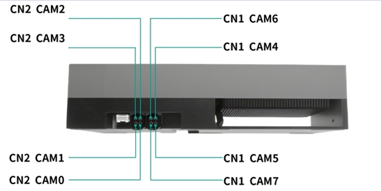
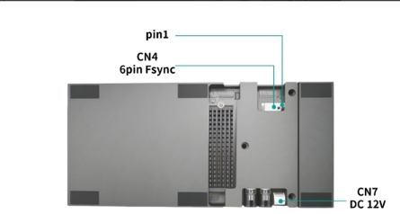

#### Jetpack version

- Jetpack 7.2 L4TR39.2

#### Supported Camera

```
Camera Model        Sensor      Resolution        Output      Interface  frame_rate  MaxDevices
   SHW5G          ST VB1940     2560*1984         RAW10         GMSL2        60           4
```
Note:Each MAX96712 can support a maximum of two SHW5G modules simultaneously.
#### Quick Bring Up

1. Flashing:

    Since NVIDIA's official pinmux definitions do not enable the I2C functionality for I2C9, nor do they enable GPIO functionality for CAM0_PWDN and CAM1_PWDN, it is necessary to modify the pinmux definitions and re-flash the device.

    Copy and replace the tegra264-mb1-bct-pinmux-p3834-xxxx-p4071-0000.dtsi and tegra264-mb1-bct-gpio-p3834-xxxx-p4071-0000.dtsi files from the ./Linux_for_Tegra/bootloader/ directory in your source folder into your flashing package, then proceed with flashing.

2. Hardware Connect

   2.1 Connect the Camera to the ports on the adapter board.

   The correspondence between CAM ports and device nodes is as follows:
   
   ```
   PORT                    DeviceTree Node           DEV NODE                    
   CAM0                        cam_0                /dev/video0                 
   CAM1                        cam_1                /dev/video1                 
   CAM2                        cam_2                /dev/video2                 
   CAM3                        cam_3                /dev/video3                 
   CAM4                        cam_4                /dev/video4                 
   CAM5                        cam_5                /dev/video5                 
   CAM6                        cam_6                /dev/video6 
   CAM7                        cam_7                /dev/video7                                 
   ```
   2.2 Power Supply
   SG8A_AGTH_G2Y_A1 adapt board need to be powered by 12V.
   

3. Copy the driver package to the working directory of the Jetson device, such as “/home/nvidia”
   ```
   /home/nvidia/TRD1_G2A_SHW5G_60fps_JP7.2_L4TR39.2
   ```
   
4. Enter the driver directory, run the script "install.sh""
   ```
   cd TRD1_G2A_SHW5Gx4_60fps_JP7.2_L4TR39.2
   chmod a+x ./install.sh
   ./install.sh
   ```

5. Use the "sudo /opt/nvidia/jetson-io/jetson-io.py" command to select the corresponding device.

   ```
   sudo /opt/nvidia/jetson-io/jetson-io.py

   1.select "Configure Jetson AGX CSI Connector"
   2.select "Configure for compatible hardware"
   3.select "Jetson Sensing SG8A_AGTH_G2Y_A1 SHW5Gx4"
   4.select "Save pin changes"
   5.select "Save and reboot to reconfigure pins"
   ```

6. Bring up the camera

   6.1  Run the script.

   ```
   cd TRD1_G2A_SHW5G_60fps_JP7.2_L4TR39.2
   sudo ./load_modules.sh
   ```
   After the module is loaded, the device nodes /dev/video0~video7 will be generated.

   6.2 Install argus_camera
   ```
   sudo apt-get install nvidia-l4t-jetson-multimedia-api
   ```
   After installation, the jetson_multimedia_api folder can be found in the /usr/src directory. Then refer to the documentation /usr/src/jetson_multimedia_api/argus/README.TXT to install argus_camera.

   You can refer to the commands in "argus_install.sh" for installation.

   6.3 Bring up the RAW camera

   Start nvargus-daemon in a terminal
   ```
   sudo service nvargus-daemon stop
   export NVCAMERA_NITO_PATH=/var/nvidia/nvcam/settings/shw5g.nito
   sudo -E enableCamInfiniteTimeout=1 nvargus-daemon
   ```
   Start argus_camera in another terminal
   ```
   ## Video0
   argus_camera -d 0 

   ## Video1
   argus_camera -d 1

   ## Video2
   argus_camera -d 2

   ## Video3
   argus_camera -d 3

   ## Video4
   argus_camera -d 4

   ## Video5
   argus_camera -d 5

   ## Video6
   argus_camera -d 6

   ## Video7
   argus_camera -d 7

   ```
   

7. Camera Trigger Sync 

   7.1 Modify load_modules.sh script and re-run it.
   ```
   v4l2-ctl -d /dev/video0 -c sensor_mode=0,trig_pin=0x00020007,trig_mode=1
   v4l2-ctl -d /dev/video1 -c sensor_mode=0,trig_pin=0x00020007,trig_mode=1
   v4l2-ctl -d /dev/video2 -c sensor_mode=0,trig_pin=0x00020007,trig_mode=1
   v4l2-ctl -d /dev/video3 -c sensor_mode=0,trig_pin=0x00020007,trig_mode=1
   v4l2-ctl -d /dev/video4 -c sensor_mode=0,trig_pin=0x00020007,trig_mode=1
   v4l2-ctl -d /dev/video5 -c sensor_mode=0,trig_pin=0x00020007,trig_mode=1
   v4l2-ctl -d /dev/video6 -c sensor_mode=0,trig_pin=0x00020007,trig_mode=1
   v4l2-ctl -d /dev/video7 -c sensor_mode=0,trig_pin=0x00020007,trig_mode=1
   ```
   The "trig_mode" and "trig_pin" parameters denote the trigger mode and the corresponding trigger pin to be utilized.
   ```
   For Auto-trigger Mode (The cameras are triggered automatically upon camera activation. However, the cameras are not synchronized):trig_mode=0;trig_pin=0x00020007

   For External Trigger mode (The cameras are synchronously triggered via the trigger signal generated by the external signal generator that is connected to the trigger Pin of the Kit):trig_mode=1;trig_pin=0x00020007
   
   For Jeston Thor  Trigger Mode (The cameras are triggered and synchronized through the trigger signal generated from the Jetson Orin):trig_mode=1;trig_pin=0x00020007
   
   ```
   7.2 External Trigger Mode

   External Trigger Port: CN4

   The PIN1(CAM-FSYNC1) and PIN6 correspond to the external trigger signal pin and ground pin respectively. Connect the corresponding pins of the signal generator to these pins.
   ```
   CAM-FSYNC1 Pin Trigger Signal Parameters:
   Frequency: 30 Hz
   Amplitude: 3.3V
   Bias: 1.6V
   Duty Cycle: 10%

   PIN 6: GND
   ```

   7.3 Jeston Thor Trigger Mode

   ```
   a.load the driver
   sudo insmod ko/pwm-gpio.ko
   
   b.Export PWM channel 0 (pwmchip4 is a newly generated node after loading the driver)
   echo 0 > /sys/class/pwm/pwmchip4/export
   
   c.Set the period to 16666666 (corresponding to 60 Hz)
   echo 16666666 > /sys/class/pwm/pwmchip4/pwm0/period
   
   d.Set the duty cycle
   echo 8333333 > /sys/class/pwm/pwmchip4/pwm0/duty_cycle
   
   e.Enable PWM output
   echo 1 > /sys/class/pwm/pwmchip4/pwm0/enable
   ```
   


