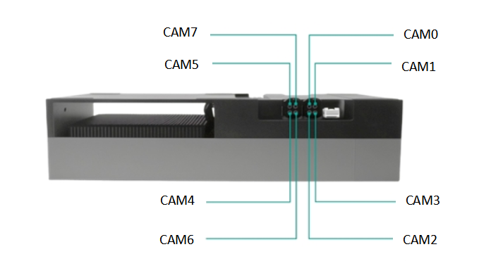

#### Jetpack version

* Jetpack 7.0 L4TR38.2.0

#### Supported Camera 

```
   Camera Model               Sensor         Resolution          Output      Interface  MaxDevices
SG8-IMX715C-G3A-HXXX       SONY IMX715       3864*2192         RAW12,30fps     GMSL3        8
SG12-IMX577C-G3A-HXXX      SONY IMX577       4056*3040         RAW10,30fps     GMSL3        4
SG17-IMX735C-G3A-HXXX      SONY IMX735       3016*5776         RAW12,30fps     GMSL3        2
SG20-AR2020C-G3A-MXXX      ONSEMI AR2020     5120*3840         RAW10,25fps     GMSL3        2
```

#### Quick Bring Up

1. Hardware Connect

   1.1 Connect the Camera to the ports on the adapter board.

   

   The correspondence between CAM ports and device nodes is as follows:
   ```
   PORT                    DeviceTree Node          DEV NODE                    
   CAM0                       cam_0               /dev/video0                 
   CAM1                       cam_1               /dev/video1                 
   CAM2                       cam_2               /dev/video2                 
   CAM3                       cam_3               /dev/video3                 
   CAM4                       cam_4               /dev/video4                 
   CAM5                       cam_5               /dev/video5                 
   CAM6                       cam_6               /dev/video6 
   CAM7                       cam_7               /dev/video7                 
   ```

   1.2 Power Supply
   SG8-AGX-Thor-GMSL3 adapt board need to be powered by 12V.

   

2. Copy the driver package to the working directory of the Jetson device, such as “/home/nvidia”

   ```
   /home/nvidia/TRD1_G3A_AGX_THOR_IMX715_IMX735_IMX577_AR2020C_JP7.0_L4TR38.2
   ```
3. Enter the driver directory, run the script "install.sh""

   ```
   cd TRD1_G3A_AGX_THOR_IMX715_IMX735_IMX577_AR2020C_JP7.0_L4TR38.2
   chmod a+x ./install.sh
   ./install.sh
   ```
4. Use the "sudo /opt/nvidia/jetson-io/jetson-io.py" command to select the corresponding device.

   Based on the type of camera you need to enable, execute the command "sudo /opt/nvidia/jetson-io/jetson-io.py" to select the corresponding device tree, and then modify "load_modules.sh" to load the appropriate camera driver file.
   ```
   Camera Model                        Device tree                        camera driver
   SG8-IMX715C-G3A-HXXX   Jetson Sensing SG8A_AGTH_G3Y_A1 IMX715x8      sg8-imx715c-g3a.ko
   SG12-IMX577C-G3A-HXXX  Jetson Sensing SG8A_AGTH_G3Y_A1 IMX577x8      sg12-imx577c-g3a.ko
   SG17-IMX735C-G3A-HXXX  Jetson Sensing SG8A_AGTH_G3Y_A1 IMX735x8      sg17-imx735c-g3a.ko 
   SG20-AR2020C-G3A-MXXX  Jetson Sensing SG8A_AGTH_G3Y_A1 AR2020x8      sg20-ar2020c-g3a.ko
   ```
   Here is the example for enabling the SG8-IMX715C-G3A-HXXX:

   ```
   sudo /opt/nvidia/jetson-io/jetson-io.py

   1.select "Configure Jetson AGX CSI Connector"
   2.select "Configure for compatible hardware"
   3.select "Jetson Sensing SG8A_AGTH_G3Y_A1 IMX715x8"
   4.select "Save pin changes"
   5.select "Save and reboot to reconfigure pins"
   ```

5. After the device reboots, modify the "load_module.sh" script.

   5.1 Select the corresponding driver.

   Use the following commands to select the driver file, choosing the correct ko file according to the connected camera. Please ensure the selected ko file matches the active device tree, or the loading process will fail.
   ```
   # sudo insmod ko/sg17-imx735c-g3a.ko
   # sudo insmod ko/sg20-ar2020c-g3a.ko
   # sudo insmod ko/sg12-imx577c-g3a.ko
   sudo insmod ko/sg8-imx715c-g3a.ko
   ```
   5.2 Modify the video device configuration command lines.

   The following commands are used to configure the cameras recognized as video0 to video7 in the system. You need to adjust the command parameter trig_mode according to the camera model and the connection used.

   ```
   v4l2-ctl -d /dev/video0 -c sensor_mode=0,trig_pin=0x00020007,trig_mode=0
   v4l2-ctl -d /dev/video1 -c sensor_mode=0,trig_pin=0x00020007,trig_mode=0
   v4l2-ctl -d /dev/video2 -c sensor_mode=0,trig_pin=0x00020007,trig_mode=0
   v4l2-ctl -d /dev/video3 -c sensor_mode=0,trig_pin=0x00020007,trig_mode=0
   v4l2-ctl -d /dev/video4 -c sensor_mode=0,trig_pin=0x00020007,trig_mode=0
   v4l2-ctl -d /dev/video5 -c sensor_mode=0,trig_pin=0x00020007,trig_mode=0
   v4l2-ctl -d /dev/video6 -c sensor_mode=0,trig_pin=0x00020007,trig_mode=0
   v4l2-ctl -d /dev/video7 -c sensor_mode=0,trig_pin=0x00020007,trig_mode=0
   ```
   The "trig_mode" and "trig_pin" parameters denote the trigger mode and the corresponding trigger pin to be utilized.
   ```
   For Auto-trigger Mode (The cameras are triggered automatically upon camera activation. However, the cameras are not synchronized):trig_mode=0;trig_pin=0x00020007

   For Jetson Orin Trigger Mode (The cameras are triggered and synchronized through the trigger signal generated from the Jetson Orin):trig_mode=1;trig_pin=0x00020007

   For External-Trigger mode (The cameras are synchronously triggered via the trigger signal generated by the external signal generator that is connected to the trigger Pin of the Kit):trig_mode=1;trig_pin=0x00020007
   ```

   Note: The SG8-IMX715C-G3A-HXXX does not support initialization in Jetson Orin Trigger Mode and External-Trigger Mode.

6. Bring up the camera

    6.1 run the script "load_module.sh".
    ```
    sudo ./load_modules.sh
    ```
    After the module is loaded, the device nodes /dev/video0~video7 will be generated.

    6.2 Install argus_camera
    ```
    sudo apt-get install nvidia-l4t-jetson-multimedia-api
    ```
    After installation, the jetson_multimedia_api folder can be found in the /usr/src directory. Then refer to the documentation /usr/src/jetson_multimedia_api/argus/README.TXT to install argus_camera.

    6.3 Bring up the camera

    Start nvargus-daemon in a terminal
    ```
    sudo service nvargus-daemon stop
    export NVCAMERA_NITO_PATH=CONFIG
    sudo -E enableCamInfiniteTimeout=1 nvargus-daemon
    ```

    Start argus_camera in another terminal
    ```
    ## Video0
    argus_camera -d 0

    ## Video1
    argus_camera -d 1

    ## Video2
    argus_camera -d 2

    ## Video3
    argus_camera -d 3

    ## Video4
    argus_camera -d 4

    ## Video5
    argus_camera -d 5

    ## Video6
    argus_camera -d 6

    ## Video7
    argus_camera -d 7
    ```
7. Provide Trigger Sync signal

   7.1 Modify load_modules.sh script and re-run it.
   ```
   v4l2-ctl -d /dev/video0 -c sensor_mode=0,trig_pin=0x00020007,trig_mode=1
   v4l2-ctl -d /dev/video1 -c sensor_mode=0,trig_pin=0x00020007,trig_mode=1
   v4l2-ctl -d /dev/video2 -c sensor_mode=0,trig_pin=0x00020007,trig_mode=1
   v4l2-ctl -d /dev/video3 -c sensor_mode=0,trig_pin=0x00020007,trig_mode=1
   v4l2-ctl -d /dev/video4 -c sensor_mode=0,trig_pin=0x00020007,trig_mode=1
   v4l2-ctl -d /dev/video5 -c sensor_mode=0,trig_pin=0x00020007,trig_mode=1
   v4l2-ctl -d /dev/video6 -c sensor_mode=0,trig_pin=0x00020007,trig_mode=1
   v4l2-ctl -d /dev/video7 -c sensor_mode=0,trig_pin=0x00020007,trig_mode=1
   ```
   Note: The SG8-IMX715C-G3A-HXXX does not support initialization in Jetson Orin Trigger Mode and External-Trigger Mode.

   7.2 External Trigger Mode

   When utilizing an external trigger signal generator to provide an external trigger signal, the trigger source should be connected to the CN4 6-PIN connector: PIN1 corresponds to the external trigger signal input, and PIN6 is the Ground pin. Connect the positive pole of the trigger signal source to PIN1, and connect the negative pole of the trigger signal source to PIN6.

   7.3 Jetson Orin Trigger Mode

   When utilize Jetson Orin Trigger Mode,it is required to configurate the trigger signal generated from the Jetson Orin via the following steps.
   ```
   a.load the driver 
   sudo insmod ko/pwm-gpios.ko

   b.Export PWM channel 0 (pwmchip4 is a newly generated node after loading the driver)
   echo 0 > /sys/class/pwm/pwmchip4/export

   c.Set the period to 33333333 (corresponding to 30 Hz)
   echo 33333333 > /sys/class/pwm/pwmchip4/pwm0/period

   d.Set the duty cycle
   echo 30000000 > /sys/class/pwm/pwmchip4/pwm0/duty_cycle

   e.Enable PWM output
   echo 1 > /sys/class/pwm/pwmchip4/pwm0/enable
   ```
#### Integration with SENSING Driver Source Code

1. Compile Image & dtb
   Refer to the following command to integrate Dtb and Kernel source code to your kernel

   ```
   cp camera-driver-package/source/hardware Linux_for_Tegra/source/hardware -r
   cp camera-driver-package/source/kernel Linux_for_Tegra/source/kernel -r
   cp camera-driver-package/source/nvidia-oot Linux_for_Tegra/source/nvidia-oot -r
   ```
2. Go to the root directory of your source code and recompile

   ```
   cd <install-path>/Linux_for_Tegra/source
   export CROSS_COMPILE=<toolchain-path>/aarch64-none-linux-gnu/bin/aarch64-none-linux-gnu-
   export KERNEL_HEADERS=$PWD/kernel/kernel-noble
   export kernel_name=noble
   export INSTALL_MOD_PATH=<install-path>/Linux_for_Tegra/rootfs/
   make -C kernel
   make modules
   make dtbs
   sudo -E make install -C kernel
   sudo -E make modules_install

   cp kernel/kernel-noble/arch/arm64/boot/Image <install-path>/Linux_for_Tegra/kernel/Image
   cp kernel-devicetree/generic-dts/dtbs/* <install-path>/Linux_for_Tegra/kernel/dtb/
   ```
3. Install the newly generated Image and dtb to your nvidia device and reboot to let them take effect

   ```
   dtbo: kernel-devicetree/generic-dts/dtbs/
   Image: kernel/kernel-noble/arch/arm64/boot/

   tegra-camera.ko: nvidia-oot/drivers/media/platform/tegra/camera/
   nvhost-nvcsi.ko: nvidia-oot/drivers/video/tegra/host/nvcsi/nvhost-nvcsi.ko
   ```
4. Copy the image,dtb,ko generated by the above compilation to the corresponding location of jetson

   ```
   sudo cp *.dtbo /boot/
   sudo cp Image /boot/Image
   sudo cp ko/tegra-camera.ko /lib/modules/6.8.12-tegra/updates/drivers/media/platform/tegra/camera/
   sudo cp ko/nvhost-nvcsi.ko /lib/modules/6.8.12-tegra/updates/drivers/video/tegra/host/nvcsi/
   ```
5. Select the device tree you installed

   ```
   sudo /opt/nvidia/jetson-io/jetson-io.py

   1.select "Configure Jetson AGX CSI Connector"
   2.select "Configure for compatible hardware"
   3.select "Jetson Sensing SG8A_AGTH_G3Y_A1 IMX715x8"
   4.select "Save pin changes"
   5.select "Save and reboot to reconfigure pins"
   ```
6. Install camera driver

   ```
   sudo insmod ko/max96726.ko
   sudo insmod ko/sg8-imx715c-g3a.ko
   ```
7. Bring up the camera

   ```
    ## Video0
    argus_camera -d 0

    ## Video1
    argus_camera -d 1
    ......
   ```
